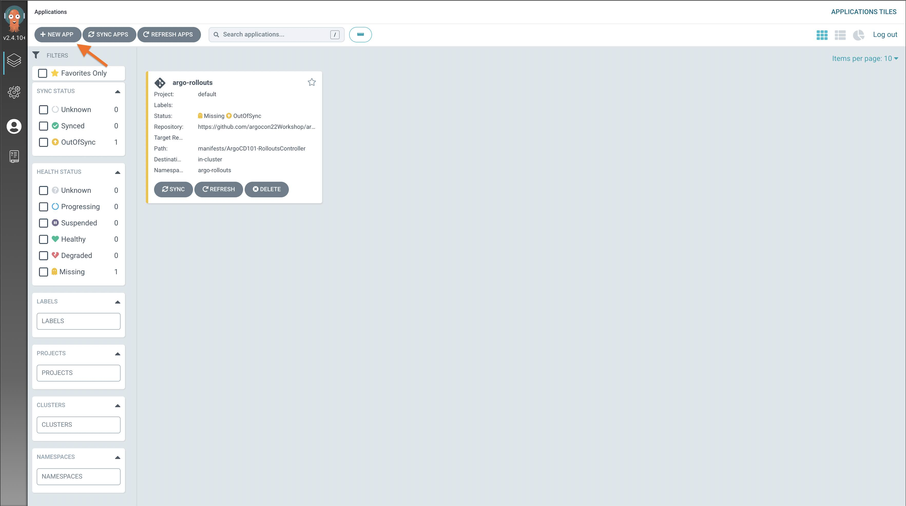
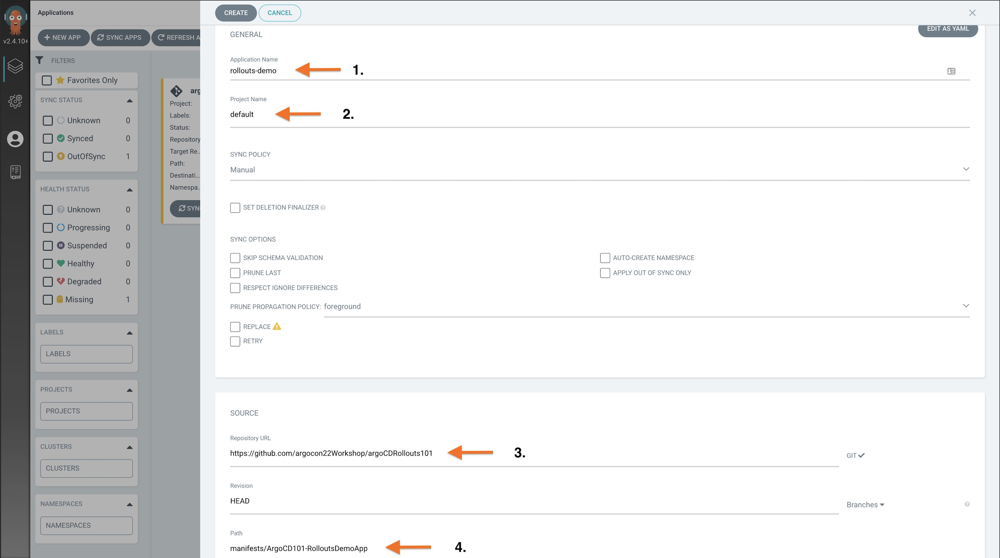
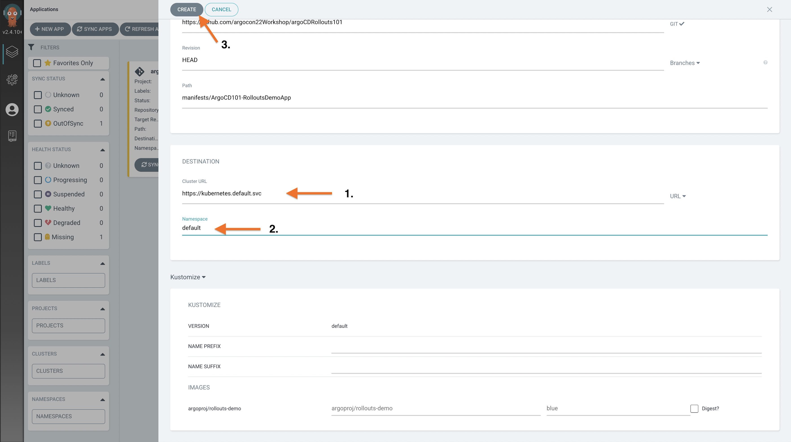

### Exercise 7: Deploying and Argo Rollouts Demo App

In this exercise we will deploy Argo Rollouts demo app and Nginx Ingress Controller via Argo CD UI.

#### Demo App Installation

1. Click on the `New App` button

1. Complete the application details as shown in the screenshot

1. Click on the `Create` button  to create argo rollout application

1. Click on the `Sync` button within the application to deploy

1. View the Demo app at: [http://localhost:81](http://localhost:81)
